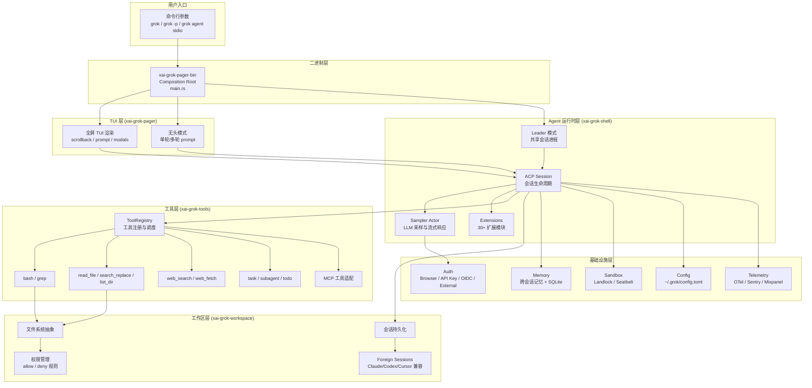
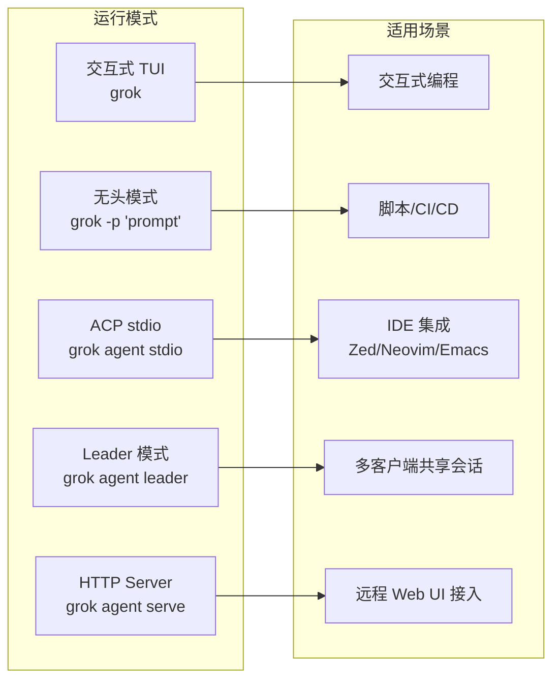
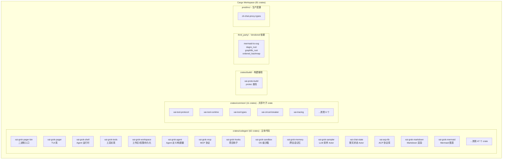
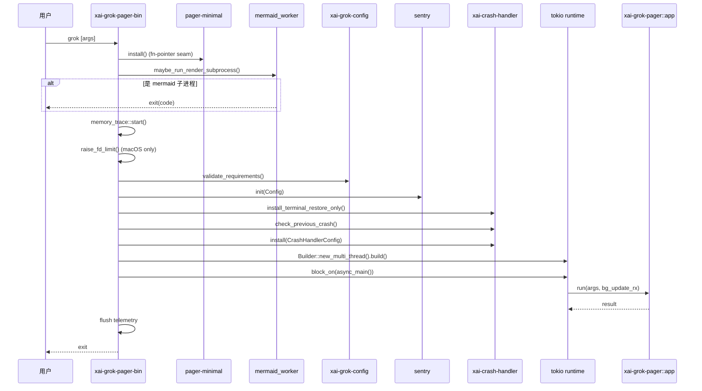
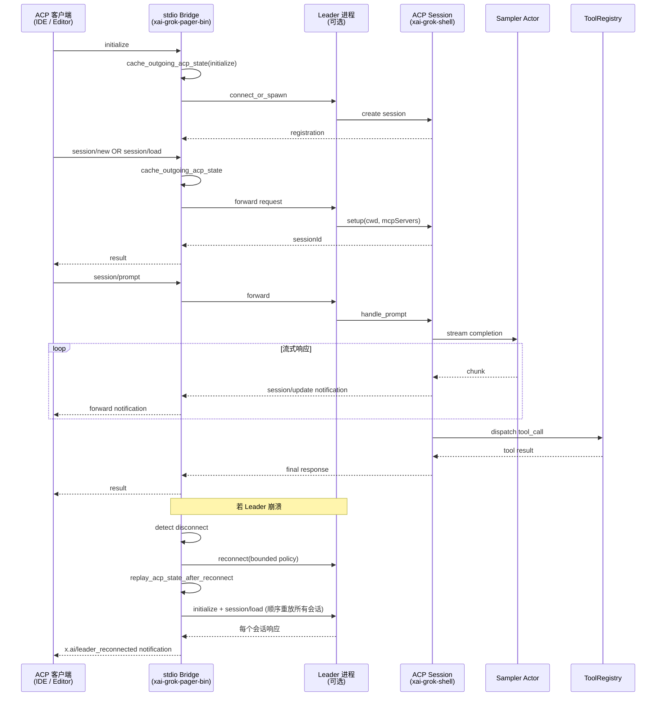
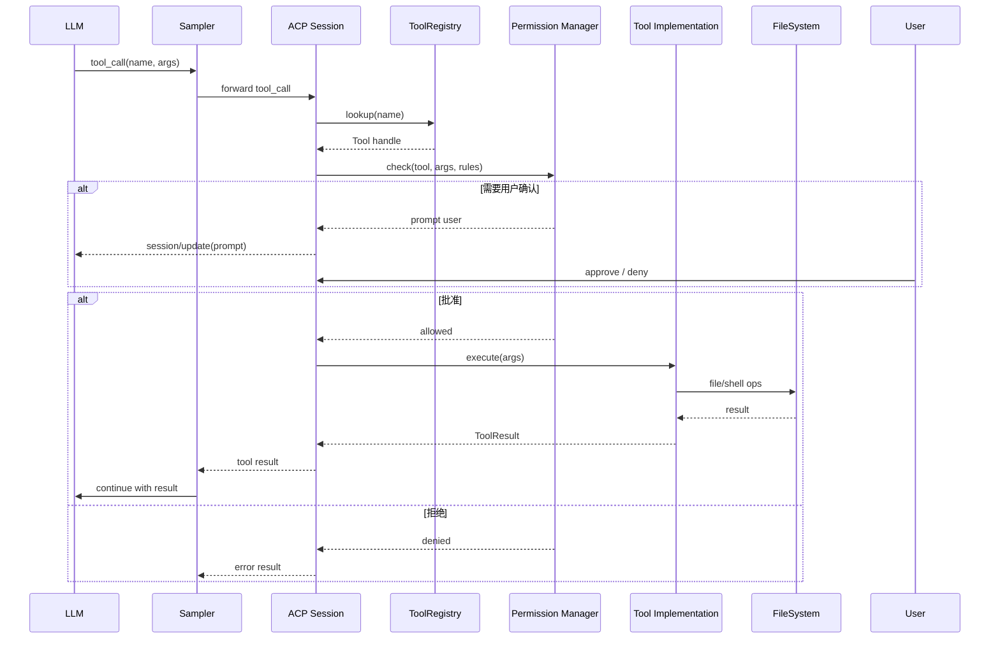
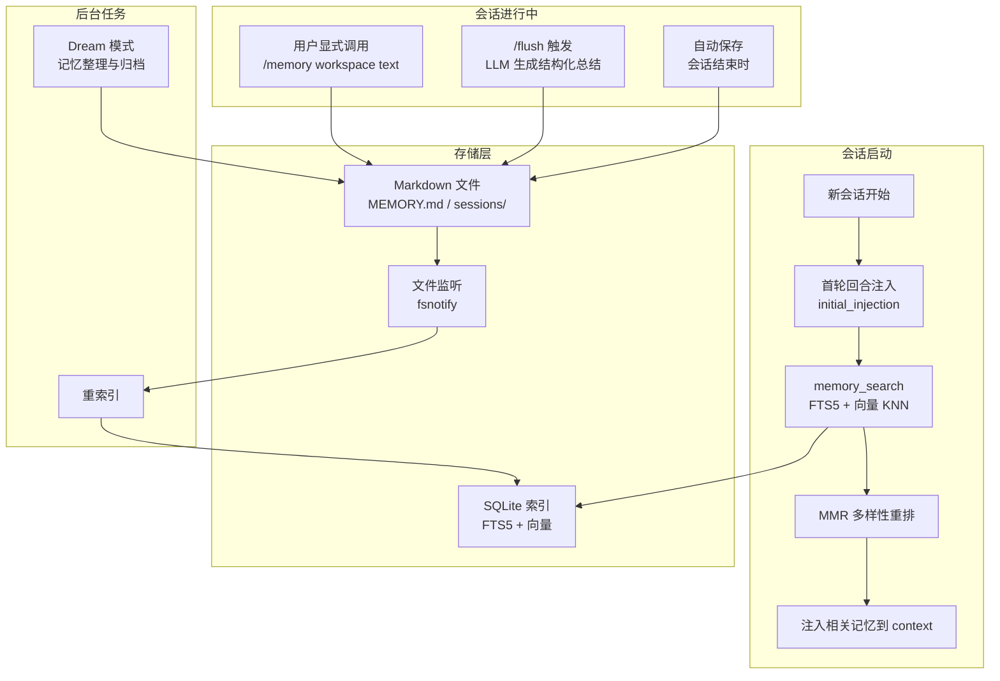

# Grok Build 项目深度分析报告

> **作者**：Wake.J  
> **团队**：DZSOFT  
> **更新时间**：2026-07-17 02:59:48  
> **分析对象**：SpaceXAI Grok Build (`grok` CLI/TUI)  
> **版本**：V1-20260717  
> **说明**：本报告基于对项目源码的静态分析,涵盖架构、模块、流程、工程化、安全等维度,供学习与借鉴参考。

---

## 一、项目概述

### 1.1 项目定位

**Grok Build** 是 SpaceXAI(马斯克旗下 xAI)推出的**终端原生 AI 编程 Agent**,基于 Rust 编写,以全屏 TUI 形式运行。它能理解代码库、编辑文件、执行 Shell 命令、搜索 Web、管理长任务,支持三种运行模式:

- **交互式 TUI** — 全屏终端编程环境(类似 Claude Code CLI)
- **无头模式(Headless)** — 用于脚本/CI/CD 自动化(`grok -p "..."`)
- **Agent 模式** — 通过 ACP 协议嵌入编辑器(Zed/Neovim/Emacs/JetBrains 等)

**对标产品**:Claude Code、OpenCode、Cursor、Codex CLI、DeepSeek-Coder。

### 1.2 关键信息

| 项目 | 值 |
|------|-----|
| 官方仓库 | https://github.com/xai-org/grok-build |
| 本地 Fork | https://github.com/weikejia123/grok-build |
| 官方文档 | https://docs.x.ai/build/overview |
| 主二进制名 | `xai-grok-pager`(安装后软链为 `grok`) |
| 当前版本 | `0.1.220-alpha.4`(pager-bin)/ `0.2.101`(shell, 2026-07-13) |
| License | Apache-2.0 |
| 接受外部 PR | 否(仅源码透明,见 CONTRIBUTING.md) |
| 同步策略 | 从 SpaceXAI monorepo 定期同步 |

### 1.3 Fork 策略

本项目对上游采取 **Add-only 模式**:仅作学习参考,不修改上游代码,所有衍生文档与实验均放置于 `my-docs/` 目录下。

---

## 二、代码规模统计

| 指标 | 数量 |
|------|------|
| 一方 Rust 源文件 | 2171 个 |
| 第三方 Rust 源文件(vendored) | 66 个 |
| `Cargo.toml` 文件 | 81 个 |
| Workspace 成员 crate | 81 个 |
| `crates/codegen/` 子 crate | 62 个 |
| `crates/common/` 子 crate | 11 个 |
| `crates/build/` 子 crate | 1 个 |
| `third_party/` 子 crate | 4 个 |
| `prod/mc/` 子 crate | 1 个 |
| 文档 markdown(`docs/`) | 27 个 |

**评价**:这是一个**超大型 Rust workspace**,规模与复杂度与 Claude Code、Codex CLI 等同类产品相当,体现了 xAI 在 AI 编程 Agent 领域的工程投入。

---

## 三、技术栈

### 3.1 核心技术栈

| 类别 | 技术 |
|------|------|
| 语言 | Rust(edition 2024) |
| 异步运行时 | tokio 1.x(multi-thread) |
| TUI 框架 | ratatui 0.29 + crossterm 0.28 |
| HTTP 客户端 | reqwest 0.12 + tower 中间件 |
| RPC 框架 | tonic 0.14(prost 0.14, protobuf) |
| 序列化 | serde + serde_json + toml + toml_edit |
| 数据库 | rusqlite 0.37(bundled SQLite,含 FTS5) |
| 全局分配器 | tikv-jemallocator(支持 heap profiling) |
| Git 操作 | gix 0.83 + git2 0.20(vendored libgit2) |
| 模板引擎 | minijinja 2.9(自定义分隔符 `${{ }}`/`$`) |
| 模糊匹配 | nucleo(helix-editor 同源) |
| Markdown | pulldown-cmark 0.13 + syntect 5.3 |
| Mermaid | 自研 `mermaid-to-svg`(vendored dagre/graphlib) |
| 加密 | ring 0.17 + rsa 0.9 + rustls 0.23 |
| 可观测性 | tracing + opentelemetry 0.32 + fastrace 0.7 + sentry |
| 跨平台文件 | dunce(规范化路径,绕过 Windows `\\?\` 前缀问题) |

### 3.2 平台支持

| 平台 | 构建支持 | 备注 |
|------|---------|------|
| macOS(aarch64/x86_64) | 一等公民 | jemalloc 16KB 页面优化 |
| Linux(gnu/musl, aarch64/x86_64) | 一等公民 | musl 含 RELRO/NX 栈加固 |
| Windows(msvc) | 尽力而为 | 未在主仓库 CI 中测试 |

---

## 四、整体架构

### 4.1 顶层架构图



### 4.2 三种运行模式



### 4.3 Workspace 划分



---

## 五、核心 Crate 分析

### 5.1 入口与组合根:`xai-grok-pager-bin`

**职责**:整个二进制的组合根(Composition Root),负责:
- 全局分配器初始化(jemalloc + heap profiling)
- 启动 mermaid 渲染子进程检测
- 内存追踪(memory_trace)装配
- 崩溃处理器(crash handler)安装
- macOS 文件描述符上限提升
- 配置校验与 Sentry 遥测初始化
- tokio 多线程运行时构建与优雅关闭

**关键设计**:
- 使用 `#[global_allocator] static GLOBAL: tikv_jemallocator::Jemalloc` 启用 jemalloc
- jemalloc 配置通过 `malloc_conf` 全局符号注入:`prof:true,prof_active:false,lg_prof_sample:19`
- 运行时通过 `tikv-jemalloc-ctl` 的 `mallctl` 接口实现内存释放钩子(`purge_jemalloc_retained_pages`)
- `run_and_shutdown` 在 runtime drop 时设置 2 秒 grace,避免阻塞任务卡死退出

**依赖说明**:`main.rs` 仅约 3000 行,但承担了所有"全局副作用"装配,这是 Rust 应用的典型组合根模式。

### 5.2 TUI 层:`xai-grok-pager`

**职责**:全屏 TUI 应用,包含:
- `app/` — 应用状态与事件循环(Elm 架构:Action → dispatch → Effect → state update)
- `views/` — UI 组件(prompt_widget、welcome、modal、picker 等)
- `scrollback/` — 消息历史渲染
- `slash/` — 斜杠命令注册与内建命令
- `acp/` — Agent Client Protocol 客户端状态
- `minimal/` — 极简渲染模式(通过 fn-pointer seam 注入,避免循环依赖)

**关键设计**:
- 使用 ratatui 0.29 + crossterm 0.28,支持 bracketed paste、event-stream
- 通过 `xai-grok-pager-minimal` 实现可选的"原生 scrollback 渲染模式",通过 fn 指针注入避免 pager → minimal → pager 的循环依赖
- 内置 3 个 playground 二进制(mouse-events、scrollback-selection、question-view、todo-pane)用于开发调试
- PTY 端到端测试按调度族拆分(`pty_e2e_smoke`、`pty_e2e_queue`、`pty_e2e_persistence` 等共 9 个独立测试目标)

### 5.3 Agent 运行时:`xai-grok-shell`

**职责**:Agent 的"应用层",是项目最复杂的 crate。包含:
- `agent/` — ACP Agent 主入口(stdio/headless/leader/serve 四种模式)
- `agent/mvp_agent/` — MVP Agent 实现(ACP 协议处理)
- `agent/subagent/` — 子 Agent 协调器
- `session/acp_session_impl/` — ACP 会话实现(30+ 子模块,涵盖 prompt 队列、工具调度、回放、记忆、目标跟踪等)
- `auth/` — 认证管理(Browser、API Key、OIDC、External、Device Code)
- `extensions/` — 30+ 扩展模块(auth、billing、git、jj、memory、recap、rewind、share、skills、task 等)
- `leader/` — Leader 模式(共享会话进程,支持多客户端)
- `sampling/` — 采样与推理编排

**关键设计**:
- `StdioReplayState` 实现 Leader 崩溃后的 ACP 状态重放(initialize + 所有 session/load),含详尽的并发测试覆盖("unknown session id"回归测试)
- `run_and_shutdown` 保证 stuck blocking 任务不会无限阻塞退出
- 通过 `xai-tool-runtime` 统一工具分发模型(内建工具 + MCP 工具)
- 会话持久化格式:`summary.json` + `updates.jsonl` + `chat_history.jsonl` + `plan.json` + `rewind_points.jsonl`

### 5.4 工具层:`xai-grok-tools`

**职责**:所有内建工具的实现与注册。结构清晰:

```
src/
├── implementations/
│   ├── codex/         # 移植自 openai/codex 的工具(apply_patch/grep_files/list_dir/read_file)
│   ├── opencode/      # 移植自 sst/opencode 的工具(bash/edit/glob/grep/read/skill/todowrite/write)
│   ├── grok_build/    # Grok 原生工具(20+ 个,含 ask_user_question/bash/grep/image_gen/lsp/monitor/scheduler/task/todo/web_fetch/web_search 等)
│   ├── grok_build_concise/  # 精简输出模式变体
│   ├── grok_build_hashline/ # 基于 hash line 的编辑方案
│   ├── memory/        # 记忆工具(get/search)
│   ├── lsp/           # LSP 客户端
│   ├── read_file/     # 通用文件读取(支持 image/pdf/pptx)
│   ├── skills/        # Skills 发现与执行
│   ├── search_tool/   # MCP 工具发现
│   ├── use_tool/      # MCP 工具调用
│   ├── web_search/    # Web 搜索
│   └── editor_infra/  # 文件操作锁
├── registry/          # ToolRegistry 注册中心
├── types/             # 类型定义(20+ 子模块)
├── util/              # 工具函数(fs/spawn/hash/image_validate 等)
└── reminders/         # 系统提醒(lsp_diagnostics/skill_discovery/task_completion)
```

**关键设计**:
- 三套编辑工具实现并存(`codex/apply_patch`、`grok_build/search_replace`、`grok_build_hashline/edit`),支持不同 prompt 模式
- 每个工具支持 `versions/` 子目录保留历史版本(如 `legacy_0_4_10.rs`),实现工具协议的向后兼容
- 通过 `tool_metadata.rs` 与 `schema/tool_meta.schema.json` 维护工具元数据
- 内置 `claude_alias.rs` 提供 Claude Code 工具名兼容

### 5.5 工作区层:`xai-grok-workspace`

**职责**:文件系统抽象、权限管理、会话持久化、Foreign Sessions 兼容。

**亮点模块**:
- `permission/` — 完整权限系统,含 `auto_mode`(自动批准)、`bash_command_splitting`(命令拆分解析)、`claude_settings`(Claude Code settings 兼容)、`hub_permission`、`rules`(glob 规则)
- `foreign_sessions/` — 兼容 Claude Code、Codex、Cursor 的会话发现与恢复,支持平台特定的进程扫描(unix/windows)
- `session/` — Checkpoint 存储、文件状态、Git/JJ 集成、Swap 策略
- `file_system/` — 多种 FS 实现(local_fs、acp_fs、client_fs、mock_fs、ext_fs),含 `codebase_index` 代码库索引与 `fuzzy` 模糊匹配

### 5.6 沙箱:`xai-grok-sandbox`

**职责**:OS 内核级文件系统/网络隔离。

**关键设计**:
- Linux 使用 **Landlock**(内核 ≥ 5.13),通过 `nono 0.53.0` 库
- macOS 使用 **Seatbelt**(同 `nono`)
- 通过 seccomp 阻塞子进程网络(Linux)
- **不可逆**:一旦应用,运行时无法放松(安全特性)
- 沙箱事件记录到 `~/.grok/sandbox-events.jsonl`
- 内置 4 个 profile:`off` / `workspace` / `read-only` / `strict`,支持自定义 + 继承

**版本锁定说明**:`nono = "=0.53.0"` 精确锁定,因为 macOS Seatbelt 的 deny 优先级依赖于 nono 的规则发射顺序,bump 可能悄然打开 bypass。

### 5.7 记忆系统:`xai-grok-memory`

**职责**:跨会话知识持久化。

**架构**:
- 存储为 Markdown 文件:`~/.grok/memory/MEMORY.md`(全局) + `~/.grok/memory/<project-slug>-<hash8>/MEMORY.md`(工作区) + `sessions/`(会话日志)
- SQLite 索引支持 **FTS5 关键词 + 可选向量 KNN** 混合搜索
- 工作区目录后缀 hash 来源于 git remote URL,保证同仓库的所有 clone/worktree 共享记忆
- `chunker.rs` — 文本分块
- `embedding.rs` — 向量嵌入(可选,需配置 `embedding.model`)
- `mmr.rs` — Maximal Marginal Relevance 多样性重排
- `dream.rs` — "Dream" 模式(后台记忆整理)
- `watcher.rs` — 文件监听与重索引

### 5.8 Agent 构建器:`xai-grok-agent`

**职责**:Agent 定义、构建、Prompt 装配。

**Agent 定义格式**:Markdown 文件 + YAML frontmatter,存放于 `.grok/agents/` 或 `~/.grok/agents/`。

**Prompt 模式**:
- `extend`(默认)— Base 模板 + body + AGENTS.md + Skills
- `full` — body 即完整 system prompt,通过 MiniJinja 渲染(自定义 `${{ }}`/`$` 分隔符避免与字面量 `{{ }}` 冲突)

**发现优先级**:项目级(cwd → git root) > 用户级 > 兼容路径 > 内建(`grok-build`、`browser-use`)

**关键特性**:
- `completionRequirement` — 强制 Agent 在结束前必须调用某工具(orchestrated 模式)
- `toolNameOverrides` / `paramNameOverrides` — 工具名/参数名重映射
- `toolConfig` — 每工具独立执行配置(如重试策略)

---

## 六、关键运行流程

### 6.1 主启动流程



### 6.2 ACP 会话生命周期



### 6.3 工具调用流程



### 6.4 记忆系统流程



---

## 七、构建配置与工程化

### 7.1 Cargo Profiles

| Profile | 用途 | 关键设置 |
|---------|------|---------|
| `dev` | 本地开发 | `opt-level=0`, `lto=false`, `incremental=true`, `panic=abort` |
| `release` | 默认发布 | `incremental=true`, `panic=abort` |
| `release-dist` | 分发构建 | `lto="thin"`, `codegen-units=1`, `debug=1`(line-tables) |
| `x-prod` | 生产服务 | `lto="thin"`, `panic=unwind`(便于捕获) |
| `release-dist-jemalloc` | 桌面发布别名 | 继承 `release-dist`,alpha 与 stable 共享便于指针替换 |
| `bench` | 性能基准 | `debug=true` |

### 7.2 二进制加固

**链接器加固**(Linux musl):`-Wl,-z,relro,-z,now,-z,noexecstack`
- Full RELRO — 防止 GOT 覆写攻击
- NX stack — 防止栈 shellcode
- 即时绑定 — 防止 lazy binding 利用

**字符串混淆**:`obfstr` + `cryptify` 用于编译期字符串与控制流混淆(主要在 `main.rs` 的 `build_update_config`)。

**Apple Silicon 优化**:`AARCH64_APPLE_DARWIN_JEMALLOC_SYS_WITH_LG_PAGE=14`(16KB 页面),`target-cpu=neoverse-v2`(Linux aarch64)。

### 7.3 Clippy 与 Lint

仓库根 `clippy.toml` 与 `crates/codegen/clippy.toml` 配置:
- 禁用 `std::fs::canonicalize` / `tokio::fs::canonicalize` — 强制使用 `dunce::canonicalize`(Windows `\\?\` 前缀问题)
- 允许 `doc_lazy_continuation` / `doc_overindented_list_items`(prost 0.14 生成代码兼容)
- 允许 `uninlined_format_args`(过渡期,等 merge queue 启用后改为 deny)

### 7.4 工具链管理

- `rust-toolchain.toml` 锁定工具链版本(rustup 自动安装)
- `bin/protoc` 是 [dotslash](https://dotslash-cli.com) launcher,自动下载对应平台 protoc
- `crates/build/xai-proto-build` 提供 protoc 发现逻辑(`find_protoc.rs`)

### 7.5 自动更新

- `xai-grok-update` crate 实现自更新
- 启动时后台检查(可禁用:`--no-auto-update` / `GROK_DISABLE_AUTOUPDATER`)
- 通道切换:`--alpha` / `--stable` / `--enterprise`
- Leader 模式下 Leader 进程负责更新,通过 `LeaderAutoUpdateConfig` 周期检查(默认 1 小时)
- 更新后通过 `ControlCommand::RelaunchForUpdate` 通知 Leader 重启

---

## 八、代码质量与测试

### 8.1 测试体系

**单元测试**:每个 crate 内嵌 `#[cfg(test)] mod tests`,如 `main.rs` 末尾的 1500+ 行测试覆盖 Leader 重连、状态重放、Workspace 门控等关键路径。

**集成测试**:
- `xai-grok-pager/tests/` 下 11 个 PTY 端到端测试族(smoke、queue、scroll_selection、minimal、config_ui、shell_tools、persistence、clipboard、leader_pty_e2e、pty_auto_mode、scripted_scenarios)
- `xai-grok-hooks/tests/integration.rs`
- `xai-fsnotify/tests/integration.rs`
- `xai-grok-shell/src/session/acp_session_tests/` 下 40+ 个细粒度测试模块(goal、laziness、turn、auth_error、interjection、permission_auto_mode、rewind、subagent_usage 等)

**基准测试**:`criterion` 框架
- `xai-grok-pager/benches/`:render、search、edit_highlight
- `xai-grok-shell/benches/`:session_list
- `xai-grok-markdown/benches/`:bench
- `xai-fsnotify/benches/`:startup

**Fuzz 测试**:`xai-grok-markdown/fuzz/`(cargo-fuzz)

**测试支持 crate**:`xai-grok-test-support`、`xai-test-utils`、`xai-grok-pager-pty-harness`

### 8.2 测试执行

```bash
cargo check -p <crate>        # 单 crate 校验(推荐)
cargo test -p xai-grok-config # 单 crate 测试
cargo clippy -p <crate>       # Lint
cargo fmt --all               # 格式化
```

> **官方提示**:全 workspace 构建很慢,应总是针对具体 crate 操作。

### 8.3 文档与可观测性

- **用户文档**:`crates/codegen/xai-grok-pager/docs/user-guide/` 下 27 个 markdown
- **在线文档**:https://docs.x.ai/build/overview
- **CHANGELOG**:`xai-grok-shell/CHANGELOG.md` + `changelogs/0.2.0.md` ~ `0.2.30.md`
- **遥测**:OpenTelemetry(tracing + OTLP)、Sentry(崩溃上报)、Mixpanel(产品分析)
- **调试**:`--debug` 启用 firehose 日志(`~/.grok/debug/<sessionId>.txt`)
- **Heap Profile**:jemalloc prof.active 可运行时开关,`dump_to_path` 输出 `.heap` 文件

---

## 九、安全机制

### 9.1 沙箱(Landlock / Seatbelt)

见 §5.6。关键点:
- **不可逆**:启动时应用,运行时无法放松
- **敏感路径永久写保护**:`~/.ssh/、~/.aws/、~/.gnupg/、~/.grok/auth/`
- **网络限制局限**:仅阻塞子进程网络,进程内 HTTP(web_search、LLM API)不受影响 — 这是设计取舍,Agent 必须能访问 LLM

### 9.2 权限系统

- **Allow / Deny 规则**:`Bash(...)` / `Edit(...)` / `Write(...)` / `Read(...)` / `Grep(...)` / `WebFetch(...)` / `MCPTool(...)`
- **Deny 优先于 Allow**
- **权限模式**:`default` / `acceptEdits` / `dontAsk` / `plan` / `auto`
- **Auto Mode**:智能判断命令安全性,自动批准安全命令(只读操作)

### 9.3 秘密处理

- `xai-grok-secrets` crate 提供 `sanitizer.rs`,自动识别并脱敏 token、API key、DSN 等
- 会话自动保存**不记录 shell 命令字符串**(避免泄露嵌入的密钥)
- `web_fetch` 内置 SSRF 防护(`ssrf.rs`)
- `auth.json` 存储凭据,敏感路径写保护

### 9.4 Folder Trust

- Hooks 执行前必须显式信任文件夹(`/hooks-trust`)
- Plugins 加载前需信任
- `--trust` CLI 标志启动时自动信任 cwd

### 9.5 凭据存储

- `~/.grok/auth.json` — 主凭据存储
- 支持多种刷新机制:Browser(OAuth)、API Key、OIDC(refresh_token)、External Provider(自定义二进制)
- 提前 5 分钟刷新(可调:`GROK_AUTH_EARLY_INVALIDATION_SECS`)
- 401/403 时自动重试一次

---

## 十、扩展性设计

### 10.1 多层扩展机制

| 机制 | 位置 | 用途 |
|------|------|------|
| **Skills** | `.grok/skills/`、`~/.grok/skills/` | 可复用 prompt 包(自然语言工作流) |
| **Agent Profiles** | `.grok/agents/`、`~/.grok/agents/` | 自定义 Agent(工具集 + system prompt) |
| **Plugins** | `.grok/plugins/`、`~/.grok/plugins/` | 外部工具/技能/MCP 打包 |
| **Hooks** | `.grok/hooks/` | 项目生命周期脚本(pre/post-tool-use、session start/end) |
| **MCP Servers** | `config.toml`、`.grok/config.toml` | Model Context Protocol 工具集成 |
| **LSP Servers** | `~/.grok/lsp.json`、`.grok/lsp.json` | 语言服务器(代码智能) |
| **Subagents** | `.grok/roles/`、`.grok/personas/` | 并行子会话(角色 + 人格) |
| **AGENTS.md** | 项目任意目录 | 项目级 system prompt 注入 |
| **Memory** | `~/.grok/memory/` | 跨会话知识持久化 |

### 10.2 Claude Code 兼容性

Grok 自动发现并加载 Claude Code 配置:
- `.claude/skills/`、`~/.claude/skills/` → Skills
- `.claude/agents/`、`~/.claude/agents/` → Subagents
- `.claude/plugins/`、`~/.claude/plugins/installed_plugins.json` → Plugins
- `~/.claude.json`、`.mcp.json` → MCP Servers
- `CLAUDE.md`、`.claude/CLAUDE.md` → 项目规则
- `.claude/settings.json` → 权限回退

### 10.3 Custom Models(BYOK)

支持 OpenAI 兼容端点:
- Ollama、OpenAI、Together AI、Anthropic、Groq、OpenRouter 等
- 通过 `[model.<name>]` 配置:`model` / `base_url` / `api_key` / `env_key` / `temperature` / `context_window` 等
- 凭据解析顺序:`api_key` → `env_key` → `XAI_API_KEY`

---

## 十一、与同类产品对比

| 维度 | Grok Build | Claude Code | OpenCode | Codex CLI |
|------|-----------|-------------|----------|-----------|
| 语言 | Rust | TypeScript | TypeScript | TypeScript |
| 运行模式 | TUI / Headless / ACP stdio / Leader / Serve | TUI / Headless | TUI / Headless | Headless |
| 编辑器集成 | ACP(Zed/Neovim/Emacs/JetBrains) | 有限 | ACP | 无 |
| OS 沙箱 | Landlock / Seatbelt(内核级) | 无 | 无 | 无 |
| 跨会话记忆 | SQLite FTS5 + 向量 KNN | 无 | 无 | 无 |
| MCP 支持 | 完整 | 完整 | 完整 | 部分 |
| Subagents | 内置 | 内置 | 内置 | 无 |
| Hooks | 完整 | 部分 | 部分 | 无 |
| Claude Code 兼容 | 是 | — | 部分 | 无 |
| LSP 集成 | 是 | 否 | 否 | 否 |
| Heap Profile | jemalloc prof | — | — | — |
| Leader 共享会话 | 是 | 否 | 否 | 否 |
| 二进制加固 | RELRO + NX + 字符串混淆 | — | — | — |
| 开源协议 | Apache-2.0(源码透明,不接受 PR) | 专有 | MIT | Apache-2.0 |

**Grok Build 的差异化优势**:
1. **Rust 原生** — 单二进制,内存安全,启动快,内存占用低
2. **OS 内核级沙箱** — 同类产品中唯一使用 Landlock/Seatbelt
3. **Leader 模式** — 多客户端共享一个 Agent 进程,适合团队/远程场景
4. **跨会话记忆** — 结构化搜索(FTS5 + 向量),自动注入
5. **二进制加固** — 字符串混淆、RELRO、NX 栈,防逆向
6. **Claude Code 兼容** — 无缝迁移现有 Claude 生态配置

---

## 十二、学习价值与借鉴点

### 12.1 架构层面

1. **Composition Root 模式** — `xai-grok-pager-bin` 作为薄二进制,仅负责全局副作用装配,业务逻辑全部在库 crate 中,便于测试与复用
2. **Elm 架构 in TUI** — Action → dispatch → Effect → state update,单向数据流,TUI 应用借鉴前端架构
3. **Actor 模型** — Sampler、ChatState 通过 Actor 隔离并发状态,通过 channel 通信
4. **Leader/Follower** — Leader 进程承载会话状态,stdio/headless client 可重连重放,这是分布式系统中的常见模式应用到本地 Agent

### 12.2 工程层面

1. **Workspace 拆分粒度** — 81 个 crate,平均每个 crate 职责单一,编译并行度高
2. **Vendored 第三方栈** — Mermaid 渲染栈(dagre/graphlib)完整 vendored,避免 npm 依赖
3. **版本兼容设计** — 工具实现保留 `versions/legacy_*.rs`,支持协议演进
4. **测试金字塔** — 单元 → 集成 → PTY e2e → 基准 → fuzz,层级清晰
5. **配置分层** — `~/.grok/config.toml` → `<repo>/.grok/config.toml` → `<cwd>/.grok/config.toml`,优先级明确
6. **dotslash 解决依赖** — `bin/protoc` 用 dotslash 自动下载平台对应 protoc,避免用户手动安装

### 12.3 Rust 技巧

1. **`dunce::canonicalize` 替代 `std::fs::canonicalize`** — Windows 路径前缀问题,通过 clippy `disallowed-methods` 强制
2. **jemalloc mallctl** — 运行时内存释放(`arena.4096.purge`)、heap profile 开关(`prof.active`)、stats 读取
3. **`#[global_allocator]` + `malloc_conf`** — 通过 extern symbol 注入 jemalloc 配置,macOS 用 `_rjem_malloc_conf`,Linux 用 `malloc_conf`
4. **fn-pointer seam** — `xai-grok-pager-minimal::install()` 通过函数指针注入避免循环依赖
5. **`tokio::runtime::Builder::shutdown_timeout`** — 防止 stuck blocking task 阻塞退出
6. **`obfstr` + `cryptify`** — 编译期字符串混淆,增加逆向难度

### 12.4 产品层面

1. **ACP 协议** — 标准化 Agent 与客户端通信,值得 IDE 集成场景借鉴
2. **Foreign Sessions 兼容** — 自动发现并恢复 Claude/Codex/Cursor 会话,降低迁移成本
3. **Multi-Auth** — Browser/API Key/OIDC/External Provider/Device Code,覆盖企业到个人全场景
4. **Skills/Agents/Hooks/Plugins** — 四层扩展,从 prompt 包到完整工具包,灵活度极高

---

## 十三、局限性与注意事项

### 13.1 已知限制

1. **不接受外部贡献** — CONTRIBUTING.md 明确说明仅源码透明,无 PR 通道
2. **定期同步上游** — README 说明从 monorepo 定期同步,本地版本可能滞后
3. **Windows 支持弱** — "best-effort, not currently tested"
4. **沙箱网络限制部分** — 仅阻塞子进程网络,进程内 HTTP 不受影响(Agent 需访问 LLM)
5. **遥测默认关闭** — 公开源码构建不带遥测默认值,需手动配置
6. **Memory 实验性** — 需 `--experimental-memory` 显式启用

### 13.2 本地 Fork 注意事项

1. **Add-only 模式** — 不修改上游代码,所有衍生内容放 `my-docs/`
2. **构建耗时** — 全 workspace 构建慢,应针对具体 crate 操作(`cargo check -p <crate>`)
3. **JDK 8 不适用** — 本项目为 Rust,无需 JDK
4. **protoc 依赖** — 首次构建会通过 dotslash 下载 protoc,需联网
5. **磁盘空间** — `target/` 目录会占用数 GB,建议定期清理

### 13.3 AI 生成代码说明

> 本报告中所有 mermaid 图表与架构分析由 AI 基于源码静态分析生成,可能存在以下局限:
> - **未覆盖运行时行为** — 仅基于代码结构推断,未执行实际运行时验证
> - **crate 间依赖关系简化** — 实际依赖图比报告中展示的更复杂
> - **版本敏感性** — 报告基于 2026-07-17 的代码快照,后续上游同步可能引入变更
> - **关键逻辑需人工复核** — 涉及 Leader 重连、ACP 重放、沙箱规则等关键路径,实际应用时需对照源码二次确认

---

## 十四、总结

Grok Build 是当前**工程化程度最高的开源 AI 编程 Agent 之一**,在架构清晰度、安全机制、扩展性、平台覆盖等方面均达到生产级水准。其核心价值在于:

1. **Rust + 单二进制** 带来的性能与部署优势
2. **OS 内核级沙箱** 提供同类产品中最强的安全隔离
3. **Leader 模式 + ACP 协议** 实现的多客户端共享与编辑器集成
4. **Claude Code 兼容** 大幅降低生态迁移成本
5. **81 个 crate 的精细化拆分** 展示了大型 Rust 项目的工程最佳实践

对于学习 AI Agent 架构、Rust 工程化、TUI 开发、ACP/MCP 协议实现的开发者,本项目具有极高的参考价值。建议从以下路径入手:

- **入门**:`xai-grok-agent/README.md` 了解 Agent 定义机制
- **进阶**:`xai-grok-pager/README.md` + `docs/user-guide/` 了解 TUI 架构
- **深入**:`xai-grok-shell/src/agent/` + `session/acp_session_impl/` 研究 Agent 运行时
- **高级**:`xai-grok-sandbox/` + `xai-grok-memory/` + `xai-grok-sampler/` 研究底层机制

---

## 附录:关键文件路径索引

| 用途 | 路径 |
|------|------|
| 项目 README | [README.md](file:///Users/weikejia/CODE/my-agent-group/projects/coder-agent/grok-build/README.md) |
| Fork 说明 | [README-WAKE.md](file:///Users/weikejia/CODE/my-agent-group/projects/coder-agent/grok-build/README-WAKE.md) |
| Workspace 配置 | [Cargo.toml](file:///Users/weikejia/CODE/my-agent-group/projects/coder-agent/grok-build/Cargo.toml) |
| 二进制入口 | [crates/codegen/xai-grok-pager-bin/src/main.rs](file:///Users/weikejia/CODE/my-agent-group/projects/coder-agent/grok-build/crates/codegen/xai-grok-pager-bin/src/main.rs) |
| TUI 库入口 | [crates/codegen/xai-grok-pager/src/lib.rs](file:///Users/weikejia/CODE/my-agent-group/projects/coder-agent/grok-build/crates/codegen/xai-grok-pager/src/lib.rs) |
| Agent 运行时 | [crates/codegen/xai-grok-shell/src/lib.rs](file:///Users/weikejia/CODE/my-agent-group/projects/coder-agent/grok-build/crates/codegen/xai-grok-shell/src/lib.rs) |
| 工具实现 | [crates/codegen/xai-grok-tools/src/lib.rs](file:///Users/weikejia/CODE/my-agent-group/projects/coder-agent/grok-build/crates/codegen/xai-grok-tools/src/lib.rs) |
| 沙箱实现 | [crates/codegen/xai-grok-sandbox/src/lib.rs](file:///Users/weikejia/CODE/my-agent-group/projects/coder-agent/grok-build/crates/codegen/xai-grok-sandbox/src/lib.rs) |
| 记忆系统 | [crates/codegen/xai-grok-memory/src/lib.rs](file:///Users/weikejia/CODE/my-agent-group/projects/coder-agent/grok-build/crates/codegen/xai-grok-memory/src/lib.rs) |
| Agent 构建器 | [crates/codegen/xai-grok-agent/src/lib.rs](file:///Users/weikejia/CODE/my-agent-group/projects/coder-agent/grok-build/crates/codegen/xai-grok-agent/src/lib.rs) |
| 用户指南 | [crates/codegen/xai-grok-pager/docs/user-guide/](file:///Users/weikejia/CODE/my-agent-group/projects/coder-agent/grok-build/crates/codegen/xai-grok-pager/docs/user-guide/) |
| Shell CHANGELOG | [crates/codegen/xai-grok-shell/CHANGELOG.md](file:///Users/weikejia/CODE/my-agent-group/projects/coder-agent/grok-build/crates/codegen/xai-grok-shell/CHANGELOG.md) |
| Cargo 配置 | [.cargo/config.toml](file:///Users/weikejia/CODE/my-agent-group/projects/coder-agent/grok-build/.cargo/config.toml) |
| Clippy 配置 | [clippy.toml](file:///Users/weikejia/CODE/my-agent-group/projects/coder-agent/grok-build/clippy.toml) |

---

**报告结束**
